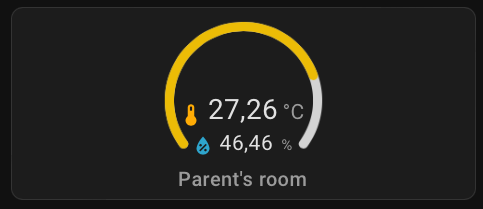

# Sojjo Temperature gauge Card by [@Sojjocola](https://github.com/Sojjocola)

Home Assistant Lovelace custom cards to display a gauge with one or two entities to link. Useful for displaying Temperature and humidity sensors in a same card

[![GitHub Release][releases-shield]][releases]
[![License][license-shield]](LICENSE.md)




## Main Options

| Name              | Type    | Requirement  | Description                                          | Default             |
| ----------------- | ------- | ------------ | ---------------------------------------------------- | ------------------- |
| type              | string  | **Required** | `custom:sojjotemperature-card`                       |                     |
| name              | string  | **Required** | Card name                                            | `none`              |
| show_error        | boolean | **Optional** | Show what an error looks like for the card           | `false`             |
| show_warning      | boolean | **Optional** | Show what a warning looks like for the card          | `false`             |
| entity            | string  | **Required** | Home Assistant entity ID.                            | `none`              |
| gaugeColor        | boolean | **Optional** | Show and link a secondary entity.                    | `none`              |
| firstUnit         | boolean | **Optional** | Unit used for the first entity                       | `°C`                |
| firstIcon         | string  | **Optional** | MDI icon associated to the first entity              | `mdi:thermometer`   |
| with_second_entity| boolean | **Optional** | Show and link a secondary entity.                    | `false`             |
| second_entity     | string  | **Optional** | Home Assistant entity ID for the secondary info.     | `none`              |
| secondUnit        | string  | **Optional** | Unit used for the second entity                      | `%`                 |
| secondIcon        | string  | **Optional** | MDI icon associated to the second entity             | `mdi:water-percent` |
| gaugeColor        | GaugeColor | **Optional** | Define the threshold of the gauge (green,yellow,red) | `none`              |
| gaugeBoundary     | GaugeBoundary | **Optional** | Define the max value of the gauge                    | `40`                |
| tap_action        | object  | **Optional** | Action to take on tap                                | `action: more-info` |
| hold_action       | object  | **Optional** | Action to take on hold                               | `none`              |
| double_tap_action | object  | **Optional** | Action to take on double tap                         | `none`              |

## GaugeColor

| Name              | Type    | Requirement  | Description                                          | Default             |
| ----------------- | ------- | ------------ | ---------------------------------------------------- | ------------------- |
| green             | number  | **Required** | Value where the green color start (before it's blue) |  `none`             |
| yellow            | number  | **Required** | Value where the yellow color start                   | `none`              |
| red               | number  | **Required** | Value where the red color start                      | `none`              |

## GaugeBoundary

| Name              | Type    | Requirement  | Description                                          | Default             |
| ----------------- | ------- | ------------ | ---------------------------------------------------- | ------------------- |
| max               | number  | **Required** | Maximum value of the gauge                           |  `none`             |

## Action Options

| Name            | Type   | Requirement  | Description                                                                                                                            | Default     |
| --------------- | ------ | ------------ | -------------------------------------------------------------------------------------------------------------------------------------- | ----------- |
| action          | string | **Required** | Action to perform (more-info, toggle, call-service, navigate url, none)                                                                | `more-info` |
| navigation_path | string | **Optional** | Path to navigate to (e.g. /lovelace/0/) when action defined as navigate                                                                | `none`      |
| url             | string | **Optional** | URL to open on click when action is url. The URL will open in a new tab                                                                | `none`      |
| service         | string | **Optional** | Service to call (e.g. media_player.media_play_pause) when action defined as call-service                                               | `none`      |
| service_data    | object | **Optional** | Service data to include (e.g. entity_id: media_player.bedroom) when action defined as call-service                                     | `none`      |
| haptic          | string | **Optional** | Haptic feedback _success, warning, failure, light, medium, heavy, selection_ | `none`      |
| repeat          | number | **Optional** | How often to repeat the `hold_action` in milliseconds.                                                                                 | `none`       |


## Configuration example

```yaml
type: custom:sojjotemperature-card
name: Parent's Room
entity: sensor.0x00158d00091c8028_temperature
firstIcon: mdi:thermometer
firstUnit: °C
with_second_entity: true
second_entity: sensor.0x00158d00091c8028_humidity
secondIcon: mdi:water-percent
secondUnit: '%'
gaugeColor:
  green: 18
  yellow: 24
  red: 28
gaugeBoundary:
  max: 35
```

##

[license-shield]: https://img.shields.io/github/license/Sojjocola/sojjo-temperature-card.svg?style=for-the-badge
[releases-shield]: https://img.shields.io/github/release/Sojjocola/sojjo-temperature-card.svg?style=for-the-badge
[releases]: https://github.com/Sojjocola/sojjo-temperature-card/releases

